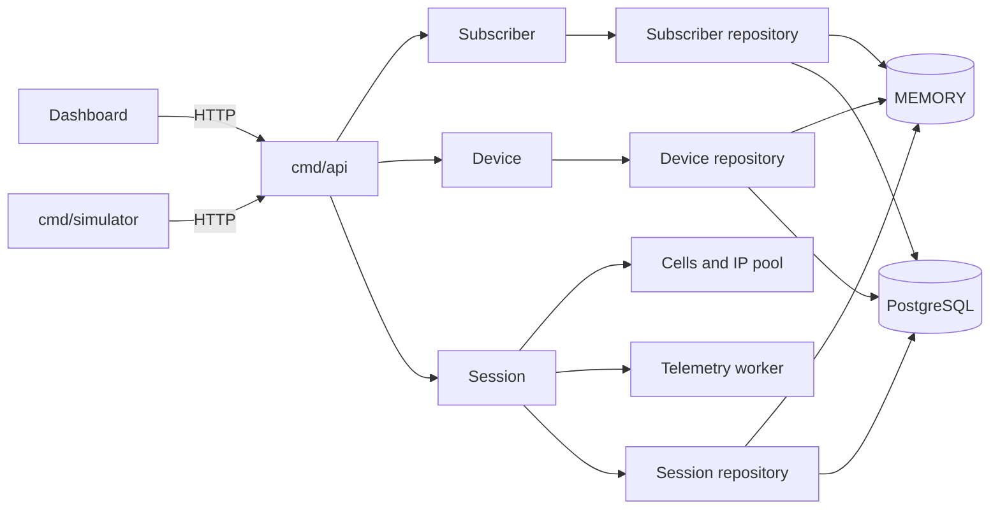

# Architecture

NEXUS Core Lab is a modular monolith. It runs as one Go process while keeping
Subscriber, Device, Session, Network, and Telemetry behavior in distinct
packages. This keeps domain transitions and failure behavior explicit without
introducing distributed-system infrastructure that the educational scope does
not require.

## Runtime composition

`cmd/api/main.go` is the composition root. At startup it:

1. starts the bounded telemetry worker;
2. creates the in-memory IP pool;
3. selects MEMORY or PostgreSQL repositories from `DATABASE_URL`;
4. validates the PostgreSQL schema and restores allocated session IPs when
   PostgreSQL is configured;
5. wires services through small consumer-owned interfaces;
6. registers HTTP routes and request telemetry;
7. coordinates graceful HTTP and telemetry shutdown.

When `NEXUS_WEB_DIR` is configured, the same process also serves the compiled
React application. `/api/*`, `/health`, and `/telemetry` always retain routing
priority. Existing static files are served directly; an extensionless unknown
frontend route receives `index.html`. API 404 responses and missing assets are
never replaced by the SPA fallback.

## Module boundaries

| Module | Responsibility |
|---|---|
| `subscriber` | Provisioning, telecom identity validation, and subscriber lifecycle |
| `device` | Device registration, technology metadata, and subscriber association |
| `session` | Attach, handover, detach, active-session rules, and IP release |
| `network` | Static cell catalog and concurrency-safe IPv4 allocation |
| `telemetry` | Asynchronous event consumption, counters, and recent event snapshots |
| `platform/httpserver` | Router, health endpoint, request ID, logging, and counters |
| `platform/postgres` | Pool configuration and expected schema validation |
| `platform/storage` | Read-only storage mode and availability diagnostics |

Dependencies point from the composition root into domain services. A consuming
module defines the narrow interface it needs: Device checks subscriber
eligibility without importing Subscriber types, and Session checks device and
subscriber eligibility through its own contract. Domain packages do not depend
on HTTP handlers or PostgreSQL implementations.

## Persistence

With no `DATABASE_URL`, the composition root creates in-memory repositories.
With `DATABASE_URL`, it opens one `database/sql` pool through pgx, requires the
expected migration version, warms the IP pool from connected sessions, and
injects PostgreSQL repositories. There is no ORM and no second diagnostic pool.

Migrations are ordered SQL up/down pairs under `migrations/`. `cmd/migrate`
applies each migration transactionally and records versions in
`schema_migrations`.

## Session and IP behavior

Attach requires a registered Device whose Subscriber is currently ACTIVE. A
successful attach reserves an address from `10.45.0.0/16`. Handover updates the
cell association while preserving the session and IP. Detach releases the IP.

Only one active session is maintained per Device. LTE and 5G values are
educational metadata; the current model deliberately does not enforce radio
compatibility. See [ADR-002](adr/ADR-002-radio-technology-as-semantic-metadata.md).

The IP pool is authoritative for the current process. In PostgreSQL mode its
allocated set is reconstructed from persisted connected sessions before the API
accepts requests.

## Telemetry and recent events

Session operations emit events to one bounded, buffered worker. Emission is
non-blocking; saturation increments `dropped_events_total` instead of blocking a
domain request. Shutdown drains accepted work within the application timeout.

The recent feed stores at most 100 events consumed by the current worker and
returns newest first. It is process-local operational context, not durable audit
history. Aggregate telemetry combines worker counters with authoritative active
session data from the repository.

## Clients

The React dashboard uses the HTTP API for operational data and commands. Its
Simulator/Sandbox page is local browser state and is labeled accordingly.

`cmd/simulator` is a separate concurrent HTTP client. Each virtual device runs
Provision → Activate → Register → Attach → Handover → Detach and then reports a
telemetry snapshot. The browser does not execute the CLI.

## Public Demo Mode

`PUBLIC_DEMO_MODE=true` replaces the shared repository graph with a registry of
anonymous visitor contexts. Each opaque cookie maps to independent in-memory
repositories, telemetry, and IP allocation. Contexts have idle and absolute
TTLs, global capacity limits, per-visitor resource limits, and mutation rate
limits. Reset swaps only the requesting visitor's context.

The public production image copies the Vite output to `/app/web` and sets
`NEXUS_WEB_DIR=/app/web`. Go serves the SPA and API on one port. The runtime is
a non-root distroless image and contains neither Node.js nor the Go toolchain.
Public Demo Mode rejects startup if `DATABASE_URL` is also present.

## Intentional boundaries

NEXUS does not implement EPC/5GC protocols, NAS, RRC, GTP, radio propagation,
authentication, authorization, durable event history, or cloud orchestration.
The architecture is sized for an educational laboratory and intentionally avoids
microservices and message-broker infrastructure.
