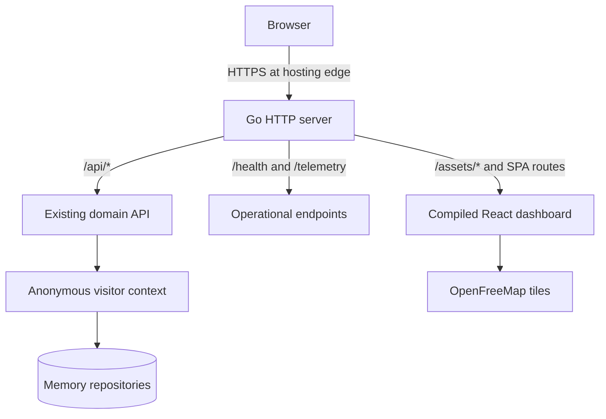

# NEXUS Core Lab — Gate 13C Public Deployment Readiness

Date: 17 September 2026
Status: implementation and local production-like validation complete; external deployment not performed

## Baseline

- Branch: `feat/demo-ui`
- Baseline local and remote commit: `c30157d4d8c8e08d1cadc94c0cac68a10d0dad01`
- Baseline working tree: clean
- Canonical frontend: `web/reference-version`
- Scope boundary preserved: no account, billing, cloud service, external deploy,
  commit, push, release, tag, DNS, or branch merge was created.

## Audit result

The existing application already had one Go composition root, configurable
`PORT`, `/health`, graceful `SIGTERM`, relative frontend API paths, Vite proxy
development, an isolated public-demo registry, TTLs, limits, reset, and security
headers. The missing production boundary was delivery of the compiled SPA.

The smallest compatible architecture is one Go process serving both the API and
the compiled frontend on the same origin. No BFF, second backend, nginx, internal
reverse proxy, or Node.js runtime was added.

## Production architecture



### Delivery decision

The selected strategy is **filesystem delivery in the final container**.

- The Node stage runs `npm ci`, `npm run test:map`, and `npm run build`.
- The Go stage builds a static Linux binary.
- The final distroless image copies the binary and Vite output to `/app/web`.
- `NEXUS_WEB_DIR=/app/web` enables frontend serving.
- Local API development remains independent from generated web output when the
  variable is absent.

This strategy keeps the Go build independent from committed/generated `dist`
files while still producing one small runtime image and one process. An embed
strategy was not also added.

## SPA serving and routing

`internal/platform/httpserver/spa.go` implements the production file handler.

- `/api`, `/api/*`, `/health`, and `/telemetry` always go to the existing API.
- Only `GET` and `HEAD` may receive SPA content.
- Real files are served directly.
- Unknown extensionless frontend routes receive `index.html`.
- Missing files under `/assets` and missing files with extensions return 404.
- API 404 responses remain API responses and are never changed to HTML.
- Directories are not listed.

Caching is explicit:

| Resource | Cache-Control |
|---|---|
| `index.html` and SPA fallback | `no-cache` |
| Vite hashed assets | `public, max-age=31536000, immutable` |
| Other real static files | `public, max-age=3600` |

Focused Go tests cover root delivery, frontend fallback, cache headers, hashed
assets, ordinary assets, extensionless missing assets, API precedence, API 404,
non-GET behavior, HEAD, and missing `index.html`.

## Container

The root `Dockerfile` has three stages:

1. `node:22-bookworm-slim` — clean frontend install, map tests, Vite build;
2. `golang:1.27-bookworm` — module download and static `cmd/api` build;
3. `gcr.io/distroless/static-debian12:nonroot` — runtime only.

Final runtime properties:

- image size: **5,966,676 bytes** (approximately 5.7 MiB);
- user: `nonroot:nonroot`;
- exposed port: `8080` only;
- Node.js absent;
- Go toolchain absent;
- shell, SSH, supervisor, and cron absent;
- CA certificate bundle present in the distroless base;
- no persistent filesystem dependency;
- existing graceful `SIGTERM` behavior confirmed in restart logs.

`.dockerignore` excludes source-control metadata, environment files,
`node_modules`, `dist`, caches, logs, evidence, development reports, temporary
files, and the legacy frontend from the build context. The clean context was
approximately 1.11 MB on the first build.

## Environment

| Variable | Public container behavior |
|---|---|
| `PORT` | Defaults to `8080`; hosting may override it |
| `NEXUS_WEB_DIR` | Defaults to `/app/web` in the image |
| `PUBLIC_DEMO_MODE` | Defaults to `true` in the image |
| `DATABASE_URL` | Must be absent in public demo mode |

An ephemeral container launched with both `PUBLIC_DEMO_MODE=true` and a dummy
`DATABASE_URL` exited immediately with the expected fatal configuration error.
The Gate 13A protection was preserved.

## Public demo and cold-start UX

The Gate 13A model remains unchanged: opaque anonymous cookie, visitor-specific
repositories, MEMORY storage, TTL cleanup, context and resource limits,
mutation-rate limiting, origin validation, body limit, and visitor-local reset.

Configuration now exposes a two-step **Reset Demo** control. Successful reset
clears only the current visitor and reloads the clean Overview. Outside Public
Demo Mode the UI reports that the operation is unavailable instead of implying
success.

The application now shows a compact connection notice while initial health is
being established and a **Try Again** action after a health failure. Its wording
states that a public demo may take a few seconds to start after inactivity and
does not promise a platform-specific time. Normal domain errors remain in their
existing operation panels.

## MapLibre bundle decision

Lazy loading was implemented because the change was small and significantly
reduced the initial JavaScript payload while preserving the map and fallback.

| Measurement | Gate 13B before | Gate 13C after |
|---|---:|---:|
| Initial JavaScript | ~1,269.73 kB | 223.17 kB |
| Initial JavaScript gzip | ~354.62 kB | 67.96 kB |
| Deferred MapTopology chunk | included above | 1,048.50 kB |
| Deferred MapTopology gzip | included above | 286.82 kB |

The initial raw JavaScript decreased by about 82.4%; initial gzip decreased by
about 80.8%. Total JavaScript is similar because MapLibre is still required when
the topology is visible. Vite correctly continues to warn that the deferred map
chunk exceeds 500 kB; further splitting was not justified for this gate.

The external Google Fonts request was removed after browser validation showed
that the restrictive CSP correctly blocked it. The interface uses its existing
system-font stack and produces no CSP console violation.

## Local production-like validation

The image was built as `nexus-core-lab:gate13c` and run only on
`127.0.0.1:18083`. Vite was not used for this validation.

Validated from the Go container:

- `/`, `/health`, API paths, SPA fallback, and compiled assets;
- explicit cache behavior;
- security headers;
- anonymous `HttpOnly` and `SameSite=Strict` cookie;
- visitor isolation;
- visitor-local UI reset;
- real Campinas cartography and OpenFreeMap attribution;
- local topology fallback when tile requests are blocked.

The official Hero Flow passed:

```text
Provision → Activate → Register → Attach CELL-SP-001
→ Handover CELL-SP-002 → Detach
```

Observed guarantees:

- Attach produced a connected Session and allocated `10.45.0.2` in the isolated
  test context.
- Handover preserved the Session ID and IP and changed the Cell.
- The map followed the authoritative Session snapshot.
- Detach removed the association, released the IP, and produced a recent event.
- A second visitor retained an independent record.
- Reset cleared visitor A and left visitor B unchanged.

The values in browser evidence are synthetic test identifiers, not PII or GPS.

## Restart behavior

A separate restart check created one subscriber, sent `docker restart`, waited
for `/health`, and queried with the previous cookie:

```text
before_restart=1 after_restart=0 health=ok
```

Logs show receipt of `SIGTERM`, graceful HTTP/application shutdown, and a clean
memory-only restart. This is the documented public-demo behavior.

## Responsiveness and browser result

The production container passed the Network layout check at:

- 1920×1080;
- 1440×900;
- 1366×768.

At all three sizes, the Network workspace's `scrollWidth/clientWidth` and
`scrollHeight/clientHeight` matched. The browser suite recorded nine passing
checks, the provider fallback passed, and there were **zero uncaught JavaScript
exceptions**. The three console 404 messages are expected handled probes for an
absent active Session, not uncaught exceptions.

Machine-readable evidence is stored at
`web/reference-version/evidence/gate13c/results.json`; PNG evidence remains
ignored by repository policy.

## README and documentation

The existing README was evolved rather than replaced with generic text. It now
covers Live Demo status, architecture, public demo architecture, exact Hero
Flow, real vs simulated behavior, Campinas map truthfulness, visitor isolation,
reset, security/privacy, MEMORY and PostgreSQL modes, local development,
Docker, testing, CI, limitations, repository structure, engineering decisions,
AI-assisted engineering disclosure, and license.

`docs/ARCHITECTURE.md` documents same-origin SPA delivery and Public Demo Mode.
`docs/API.md` documents visitor context behavior and the reset endpoint. No live
URL was invented.

## CI

The existing GitHub Actions workflow remains one proportionate verification
job. It now includes:

- Go formatting check;
- `go vet`, build, tests, race detector, and existing PostgreSQL service/tests;
- `npm ci`, `npm run test:map`, and `npm run build`;
- production Docker build.

It performs no deployment and contains no cloud credential.

## Security review

Confirmed:

- no secrets, tokens, credentials, `.env`, PII, or GPS data added;
- no permissive CORS policy;
- CSP, `X-Content-Type-Options`, `Referrer-Policy`, `X-Frame-Options`, and
  `Permissions-Policy` preserved for the public service;
- geolocation, camera, and microphone remain blocked;
- cookie remains opaque, anonymous, `HttpOnly`, `SameSite=Strict`, and `Secure`
  when TLS or `X-Forwarded-Proto: https` is present;
- request body limit, origin validation, demo limits, rate limiting, TTLs, and
  visitor-local reset preserved;
- public compiled assets contain no `C:\Users` path, username, `localhost`,
  `127.0.0.1`, database URL, password, API key, or token;
- npm clean install reported 0 vulnerabilities;
- runtime is non-root and contains no development toolchain.

## Hosting readiness audit

Facts below were revalidated against official provider documentation on
17 September 2026. No account or service was created.

### Koyeb

Koyeb remains technically compatible: GitHub deployment can build a repository
Dockerfile, Web Services receive a `PORT` variable, HTTP `/health` checks can be
configured, and a `koyeb.app` domain receives built-in TLS.

The Free Instance provides 512 MB RAM, 0.1 vCPU, and 2 GB SSD, with one Free
Instance per organization. It is limited to Frankfurt or Washington, D.C., has
no volume support, and automatically scales to zero after one hour of no
traffic. Koyeb documents a 1–5 second deep-sleep cold start.

Koyeb currently **requires a credit card** for fraud prevention and documents a
**USD 29 pre-authorization hold** that it immediately cancels; the issuing bank
may take 7–21 days to release it. This is the decisive current blocker for the
requested card-free first deployment.

Official sources:

- [Deploy with GitHub](https://www.koyeb.com/docs/build-and-deploy/deploy-with-git)
- [Free Instance limits](https://www.koyeb.com/docs/reference/instances)
- [Scale to Zero](https://www.koyeb.com/docs/run-and-scale/scale-to-zero)
- [Pricing FAQ and card requirement](https://www.koyeb.com/docs/faqs/pricing)
- [Health checks](https://www.koyeb.com/docs/run-and-scale/health-checks)
- [Edge network and TLS](https://www.koyeb.com/docs/reference/edge-network)

### Render

Render supports Dockerfile/GitHub Web Services, a configurable HTTP health path,
the `PORT` environment variable, a public `onrender.com` subdomain, managed TLS,
and HTTPS redirect/termination at its load balancer.

The Free Web Service provides 0.1 CPU and 512 MB RAM. It spins down after 15
minutes without inbound traffic and Render documents roughly one minute to spin
back up, during which browsers see a loading page. Each workspace receives 750
free instance hours per month. The filesystem is ephemeral and free services
may restart, which matches this intentionally memory-only demo.

Render's official first-deploy documentation states that no payment is required
for the free tutorial. If no payment method is present and included bandwidth or
build minutes are exhausted, Render suspends free services or disables new
builds rather than charging the account.

Official sources:

- [First deploy and no-payment statement](https://render.com/docs/your-first-deploy)
- [Free service limits](https://render.com/docs/free)
- [Web Services, Docker, PORT, domains and TLS](https://render.com/docs/web-services)
- [Health checks](https://render.com/docs/health-checks)
- [Compute plans](https://render.com/docs/compute-plans)

### Recommendation for Human Review

The container is technically suitable for both providers. **Render is the
recommended card-free next step** because it currently documents a free deploy
without payment. Its longer cold start is mitigated by Render's loading page and
the application's connection notice/retry behavior.

Koyeb remains the stronger technical option for its one-hour idle period and
shorter documented deep-sleep wake-up, but it is not suitable for the immediate
no-card requirement. This recommendation does not change hosting automatically;
Human Review must explicitly authorize any external deployment.

## Validation results

| Check | Result |
|---|---|
| `gofmt` | PASS |
| `go vet ./...` | PASS |
| `go build ./...` | PASS |
| `go test -count=1 ./...` | PASS |
| `go test -race -count=1 ./...` | PASS in official Go 1.27 Linux container |
| Data races | 0 |
| `npm ci` | PASS, 0 vulnerabilities |
| `npm run test:map` | PASS, 6/6 |
| `npm run build` | PASS |
| Docker clean build | PASS |
| Container `/health` | PASS |
| Browser Gate 13C | PASS, 9/9 |
| Hero Flow | PASS |
| Provider fallback | PASS |
| Restart/ephemeral state | PASS |
| JavaScript exceptions | 0 |

`TEST_DATABASE_URL` was unavailable in the final local environment, so the real
PostgreSQL integration tests were not executed locally. No database was created
for Gate 13C. CI retains its PostgreSQL 16 service and applies the existing
migrations before running the complete Go suite. The production-like container
validation intentionally used Public Demo Mode and MEMORY storage.

## Files changed

- `.dockerignore`
- `.github/workflows/ci.yml`
- `Dockerfile`
- `README.md`
- `cmd/api/main.go`
- `docs/API.md`
- `docs/ARCHITECTURE.md`
- `internal/platform/httpserver/spa.go`
- `internal/platform/httpserver/spa_test.go`
- `web/reference-version/index.html`
- `web/reference-version/package.json`
- `web/reference-version/src/App.tsx`
- `web/reference-version/src/api.ts`
- `web/reference-version/src/monitoring.tsx`
- `web/reference-version/src/transport.css`
- `web/reference-version/tests/gate13c.cjs`
- `web/reference-version/evidence/gate13c/results.json`
- `web/reference-version/GATE13C_PUBLIC_DEPLOYMENT_READINESS.md`

## Known limitations

- No public URL exists yet.
- Public data is deliberately ephemeral.
- Render Free cold starts are substantially longer than Koyeb's documented
  deep-sleep wake-up.
- Koyeb requires a card and temporary pre-authorization hold.
- The deferred MapLibre chunk remains about 1.05 MB minified.
- OpenFreeMap is an external public tile provider; the local topology fallback
  remains the degraded mode.
- This remains an educational telecom model, not production-grade telecom
  infrastructure.

## Source-control state

Final validation remained on branch `feat/demo-ui`, based on commit
`c30157d4d8c8e08d1cadc94c0cac68a10d0dad01`. The tracked diff and all untracked
Gate 13C files remain unstaged for Human Review.

Tracked `git diff --stat`: 11 files changed, 288 insertions, 128 deletions.
Seven legitimate untracked files are present: `.dockerignore`, `Dockerfile`, the
SPA handler and its test, this report, the browser result JSON and the Gate 13C
browser test. `git diff --check` passed. The security scan found zero
high-confidence secrets and zero forbidden generated artifacts.

No staging, commit, push or external deployment was performed.
