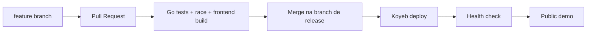
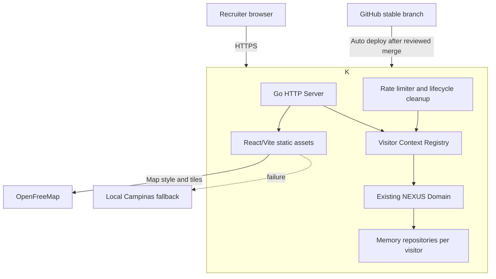

# NEXUS CORE LAB — Public Interactive Demo
## Architecture Options Report

Nenhum código, arquivo, dependência, conta ou configuração de deploy foi alterado nesta etapa. A correção visual pendente da página **Network** também ficou fora deste trabalho arquitetural.

## 1. Requisitos consolidados

A demonstração pública deverá:

- abrir diretamente pelo navegador;
- priorizar infraestrutura gratuita;
- suportar dezenas de avaliações ocasionais;
- executar o fluxo real existente do NEXUS;
- manter dados de cada visitante isolados;
- usar somente identidades e coordenadas fictícias;
- oferecer reset individual;
- funcionar com cold start e reinicializações;
- proteger os recursos contra abuso básico;
- exibir Campinas em um mapa interativo;
- deixar claro o que é real e o que é simulado;
- fazer deploy controlado a partir do GitHub;
- apresentar uma jornada curta e compreensível para recrutadores.

O Hero Flow continuará sendo:

1. cadastrar Subscriber;
2. registrar Device;
3. criar Attach;
4. observar a sessão no dashboard e no mapa;
5. executar Handover;
6. observar a mudança de célula;
7. executar Detach;
8. confirmar o encerramento da sessão e a liberação do IP.

## 2. Modelo simplificado de ameaça e abuso

Os riscos mais prováveis para uma demonstração pública são:

- bots criando milhares de entidades;
- requisições repetidas ao Simulator;
- consumo excessivo de memória;
- valores maliciosos em campos de texto;
- colisão entre dados de visitantes;
- requisições cross-origin;
- corpos HTTP grandes;
- uso indevido de identificadores pessoais reais;
- indisponibilidade do provedor gratuito;
- esgotamento das cotas do mapa;
- reinicialização inesperada apagando dados temporários.

As proteções recomendadas são:

- rate limiting por IP e sessão de demonstração;
- limite de entidades por visitante;
- limite global de visitantes ativos;
- expiração automática;
- tamanho máximo de request;
- validação e escape dos valores exibidos;
- CORS desabilitado para terceiros;
- validação de `Origin` nas mutações;
- cookie seguro e `HttpOnly`;
- cabeçalhos CSP e de segurança;
- botão de reset apenas para o contexto atual;
- mensagem explícita para não inserir dados pessoais;
- fallback local para o mapa.

## 3. Isolamento entre visitantes

A melhor solução inicial é criar um **workspace efêmero por visitante**.

Na primeira requisição, o backend gera um identificador aleatório de pelo menos 128 bits e o envia em um cookie:

- `HttpOnly`;
- `Secure`;
- `SameSite=Strict`;
- sem dados pessoais;
- com tempo de expiração curto.

Esse identificador seleciona um conjunto próprio de repositories em memória:

```text
Visitante A
  ├── Subscribers
  ├── Devices
  ├── Sessions
  ├── Events
  └── IP Pool

Visitante B
  ├── Subscribers
  ├── Devices
  ├── Sessions
  ├── Events
  └── IP Pool
```

O cookie não representa autenticação nem identidade humana. Ele serve apenas para impedir que dois avaliadores operem sobre o mesmo cenário.

Parâmetros iniciais propostos:

- expiração por inatividade: 30 minutos;
- duração máxima: 2 horas;
- máximo de 20 Subscribers por visitante;
- máximo de 20 Devices;
- máximo de 10 sessões simultâneas;
- máximo de 100 contextos ativos no processo;
- remoção por expiração e LRU quando necessário.

Esses valores devem ser confirmados por teste de carga antes do deploy.

## 4. Estratégia de reset

Será adicionado conceitualmente:

```http
POST /api/v1/demo/reset
```

O endpoint deverá:

- remover somente os dados do visitante atual;
- recriar o IP Pool desse contexto;
- limpar sessões e eventos;
- manter o cookie ou rotacioná-lo de forma segura;
- nunca executar reset global;
- responder de forma idempotente.

A interface mostrará algo como:

> Demo pública: os dados são temporários e pertencem somente a esta sessão do navegador.

O restart do serviço também limpará os dados, o que é aceitável para esta primeira versão.

## 5. MEMORY versus PostgreSQL

| Aspecto | MEMORY isolado | PostgreSQL gratuito | Híbrido em runtime |
|---|---|---|---|
| Custo | Zero | Pode ser zero, sujeito a cotas | Mais complexo |
| Reset individual | Muito simples | Exige limpeza por tenant | Moderado |
| Persistência | Não | Sim | Parcial |
| Isolamento | Natural por contexto | Exige namespace/tenant | Duas regras |
| Cold start | Um serviço | Serviço + banco | Serviço + banco |
| Segredos | Nenhum DSN | Exige credencial | Exige credencial |
| Manutenção | Baixa | Maior | Maior |
| Escala em múltiplas instâncias | Limitada | Melhor | Melhor |
| Adequação atual | Excelente | Desnecessária | Desnecessária |

### Recomendação

Usar **MEMORY isolado por visitante** na demonstração pública.

O suporte PostgreSQL continua sendo parte real do projeto, validado localmente e em testes de integração. Ele não precisa ser usado no ambiente público apenas para provar que existe.

O Neon oferece uma camada gratuita sem cartão, 0,5 GB por projeto e compute que escala para zero, sendo uma opção futura caso persistência pública se torne necessária. Ainda assim, introduziria credenciais, limpeza de dados, migrations no deploy e outro cold start. [Neon pricing](https://neon.com/pricing)

Não recomendo arquitetura híbrida em runtime nesta versão.

## 6. Comparação de hospedagem

| Plataforma | Free tier | Cold start | Go/Docker | GitHub | HTTPS | Avaliação |
|---|---:|---:|---:|---:|---:|---|
| **Koyeb** | 1 instância, 0,1 vCPU, 512 MB, 2 GB | Aproximadamente 1–5 s após sleep | Sim | Sim | Sim | Recomendada |
| Render | 512 MB e 750 h/mês | Pode chegar a cerca de 1 minuto | Sim | Sim | Sim | Bom fallback |
| Fly.io | Sem free tier permanente | Variável | Sim | Sim | Sim | Fora do objetivo gratuito |

A instância gratuita do Koyeb entra em sleep após aproximadamente uma hora sem tráfego e o despertar documentado costuma levar de 1 a 5 segundos. A região de Washington é a opção gratuita mais adequada para usuários no Brasil. [Koyeb instance reference](https://www.koyeb.com/docs/reference/instances), [scale to zero](https://www.koyeb.com/docs/run-and-scale/scale-to-zero)

O Koyeb oferece deploy por GitHub, domínio `koyeb.app`, TLS e suporte a Docker. [Git deployment](https://www.koyeb.com/docs/build-and-deploy/deploy-with-git), [custom domains](https://www.koyeb.com/docs/run-and-scale/domains)

O Render é operacionalmente simples, mas serviços gratuitos dormem após 15 minutos e podem levar aproximadamente um minuto para responder novamente. Isso prejudica uma avaliação curta feita por recrutadores. O PostgreSQL gratuito do Render também expira após 30 dias. [Render free services](https://render.com/docs/free)

O Fly.io não mantém uma camada gratuita geral e exige cartão, portanto fica fora desta primeira implantação. [Fly.io cost management](https://fly.io/docs/about/cost-management/)

### Recomendação

**Koyeb Free**, com uma única instância em Washington e limites estritos de recursos.

O projeto deve manter uma receita alternativa para Render caso a política gratuita do Koyeb mude.

A existência de uma Free Instance não garante cadastro sem cartão. A documentação vigente indica que o plano Starter pode exigir um método de pagamento válido. Essa condição deverá ser verificada novamente no Gate de deploy antes da escolha definitiva, sem criar conta ou configurar cobrança durante o Gate 13A.

## 7. Frontend e backend: juntos ou separados

### Opção A — serviço único, mesma origem

O Dockerfile executaria:

1. build do Vite em uma etapa Node;
2. build do backend em uma etapa Go;
3. inclusão do `dist` no container final;
4. Go servindo a SPA e a API.

Vantagens:

- um único deploy;
- um único cold start;
- nenhuma configuração de CORS;
- cookies de isolamento simples;
- um domínio;
- menor superfície de falhas;
- frontend e backend sempre compatíveis.

### Opção B — frontend estático e backend separado

Vantagens:

- frontend acorda imediatamente;
- hospedagem estática normalmente gratuita.

Problemas:

- a tela abre enquanto a API ainda está dormindo;
- CORS e cookies cross-site ficam mais delicados;
- dois deploys e dois domínios;
- maior possibilidade de versões incompatíveis;
- experiência de “dashboard aberto, sistema indisponível”.

### Recomendação

Usar **frontend e backend no mesmo serviço e na mesma origem**.

Para esta demonstração, simplicidade e previsibilidade valem mais que carregar o HTML alguns segundos antes da API.

## 8. Comparação de provedores de mapa

| Provedor | Chave | Cota | Uso público | Observação |
|---|---:|---:|---:|---|
| **OpenFreeMap** | Não | Declara uso gratuito sem limites públicos | Adequado para demo | Melhor opção inicial |
| MapTiler Free | Sim | 5 mil sessões e 100 mil requests/mês | Pessoal, testes e P&D | Fallback comercial controlado |
| `tile.openstreetmap.org` direto | Não | Sem cota garantida | Desaconselhado para aplicação pública | Pode bloquear uso intenso |
| Google Maps | Sim e billing | Cobrança conforme uso | Adequado tecnicamente | Fora do objetivo atual |

O OpenFreeMap declara serviço sem API key, sem registro e sem limites publicados, usando dados do OpenStreetMap. Continua sendo um serviço comunitário sem SLA contratual. [OpenFreeMap](https://openfreemap.org/)

O MapTiler Free exige conta e chave, oferece 5 mil sessões mensais e pausa o serviço quando a cota gratuita termina. [MapTiler pricing](https://www.maptiler.com/cloud/pricing/)

Os servidores padrão do OpenStreetMap são best effort e sua política deixa claro que acesso pode ser bloqueado. Eles não devem ser utilizados diretamente como infraestrutura principal do produto. [OSM tile usage policy](https://operations.osmfoundation.org/policies/tiles/)

### Recomendação

- OpenFreeMap como fonte primária;
- atribuição visível;
- imagem/SVG local atual como fallback;
- nenhuma chamada ao Google Maps;
- nenhum token secreto de mapa.

## 9. Viabilidade do MapLibre

O MapLibre GL JS é adequado porque:

- é open source;
- renderiza mapas WebGL;
- aceita estilos remotos;
- suporta GeoJSON;
- permite atualizar sources sem recriar o mapa;
- suporta markers, layers e controles;
- integra-se diretamente ao React sem wrapper adicional obrigatório.

[Documentação oficial do MapLibre GL JS](https://maplibre.org/maplibre-gl-js/docs/)

Integração conceitual:

```text
Snapshot real do domínio
        │
        ▼
Conversão para GeoJSON
        │
        ├── Cells
        ├── Devices conectados
        ├── Linhas Device → Cell
        └── Handover em andamento
        ▼
MapLibre sources/layers
```

Comportamento esperado:

- `ATTACH`: device aparece ligado à célula;
- `HANDOVER`: vínculo é transferido para a nova célula;
- `DETACH`: device e conexão dinâmica desaparecem;
- células permanecem em coordenadas fictícias fixas;
- mapa permanece centrado em Campinas;
- nenhum GPS do navegador será solicitado.

Se o WebGL ou o provedor falhar, o componente volta ao mapa local atual mantendo os overlays.

## 10. Restrições do free tier

A arquitetura gratuita aceita conscientemente:

- uma única instância;
- CPU limitada;
- 512 MB de memória;
- cold start;
- filesystem efêmero;
- ausência de SLA;
- reinicializações;
- perda dos contextos em memória;
- latência maior fora dos Estados Unidos;
- possível alteração futura nas políticas dos fornecedores;
- ausência de alta disponibilidade.

Ela não é destinada a produção telecom, carga real ou dados pessoais.

Para dezenas de avaliações ocasionais, essas limitações são aceitáveis.

## 11. Experiência de cold start

A interface e o README devem explicar:

> A demonstração usa infraestrutura gratuita. A primeira abertura após um período sem uso pode levar alguns segundos.

O frontend terá:

- estado de conexão inicial claro;
- retry automático limitado;
- mensagem específica para indisponibilidade temporária;
- botão “Tentar novamente”;
- distinção entre API acordando e operação de domínio falhando.

Com Koyeb, o cold start previsto de poucos segundos é tolerável. No Render, o atraso próximo de um minuto seria uma preocupação maior.

## 12. Deploy pelo GitHub

Fluxo recomendado:



Regras:

- confirmar a branch padrão real durante o Gate de implementação;
- usar a branch estável, provavelmente `main`, como fonte do deploy;
- nunca fazer deploy automático de `feat/demo-ui`;
- exigir CI verde antes do merge;
- Koyeb observa apenas a branch estável;
- preservar a versão anterior para rollback;
- secrets somente nas configurações da plataforma;
- nenhum `.env` enviado ao Git.

## 13. Arquitetura recomendada



Componentes principais:

- Docker multi-stage;
- Go servindo API e SPA;
- registry de contextos anônimos;
- repositories MEMORY por visitante;
- lifecycle cleanup;
- rate limiting;
- MapLibre + OpenFreeMap;
- fallback local;
- CI antes do merge;
- deploy para Koyeb Free.

Essa é a arquitetura recomendada para a primeira versão pública.

## 14. Escopo estimado

Complexidade: **média**.

Estimativa de execução completa: aproximadamente **4 a 7 dias focados**, incluindo testes e revisão visual.

Trabalho previsto:

- isolamento e lifecycle backend;
- reset individual;
- rate limiting e limites de entidades;
- Docker e static serving;
- mapa MapLibre;
- fallback;
- estados de cold start;
- aviso de dados fictícios;
- jornada guiada;
- correção do corte da página Network;
- testes de isolamento e concorrência;
- CI e configuração do deploy;
- evolução do README;
- teste público em desktop e mobile.

## 15. Principais riscos

| Risco | Mitigação |
|---|---|
| Política gratuita muda | Receita de deploy alternativa no Render |
| OpenFreeMap indisponível | Fallback local automático |
| Memória esgotada | TTL, LRU e limites por visitante |
| Visitantes compartilham dados | Contexto por cookie aleatório |
| Cold start | Koyeb e mensagem clara |
| Dados pessoais inseridos | Gerador de identidades fictícias e aviso explícito |
| Abuse de Simulator | Rate limiting e teto de mutações |
| XSS em campos | Validação e renderização escapada |
| Deploy incompatível | Branch estável e CI obrigatório |
| Múltiplas instâncias no futuro | Migrar estado para PostgreSQL antes de escalar |

## 16. O que continuará intencionalmente simulado

- IMSI;
- MSISDN;
- IMEI;
- dispositivos;
- localização dos dispositivos;
- coordenadas das células;
- cobertura e tecnologia radioelétrica;
- movimento durante handover;
- intensidade de sinal;
- infraestrutura LTE/5G;
- tráfego radioelétrico;
- qualquer interação com operadoras;
- qualquer GPS de usuário.

O produto deve dizer isso diretamente.

## 17. O que será realmente executado

A demonstração executará de verdade:

- backend Go;
- endpoints HTTP;
- validações de domínio;
- repositories;
- Attach;
- alocação de IP;
- criação de Session;
- Handover;
- Detach;
- liberação de IP;
- geração e consulta de eventos;
- atualização do dashboard;
- isolamento por visitante;
- rate limiting;
- lifecycle e reset;
- renderização MapLibre;
- carregamento de dados cartográficos reais de Campinas;
- deploy e health check públicos.

Isso torna a demonstração tecnicamente real, mesmo trabalhando com um laboratório telecom simulado.

## 18. Evolução do README

O README existente deve ser preservado e ampliado com:

- link destacado para **Live Demo**;
- aviso sobre cold start;
- botão ou seção “Try the Hero Flow”;
- roteiro de avaliação em menos de cinco minutos;
- diagrama da arquitetura pública;
- explicação do isolamento;
- tabela “real versus simulated”;
- instruções para reset;
- limitações do free tier;
- atribuição do mapa;
- segurança e privacidade;
- processo de deploy;
- screenshots atualizados;
- troubleshooting;
- instruções locais Memory e PostgreSQL;
- resultados de testes;
- decisões arquiteturais;
- roadmap sem promessas artificiais.

A linguagem deve parecer de uma equipe de engenharia: direta, verificável e sem alegações promocionais exageradas.

## 19. Jornada do avaliador

Jornada alvo, com duração de 3 a 5 minutos:

1. abrir o link;
2. aguardar eventual cold start;
3. ler a indicação de laboratório com dados fictícios;
4. escolher “Start guided demo”;
5. cadastrar Subscriber fictício;
6. registrar Device compatível;
7. executar Attach;
8. observar IP, sessão, evento e posição no mapa;
9. executar Handover;
10. observar a transferência no mapa e no feed;
11. executar Detach;
12. confirmar liberação do IP;
13. usar Reset Demo se quiser repetir;
14. abrir o GitHub pelo link do README para avaliar arquitetura e testes.

A interface pode destacar o próximo passo sem criar um fluxo artificial paralelo. Cada ação continuará chamando o domínio real existente.

## 20. Gate de implementação proposto

### Gate 13 — Public Demo Foundation

1. auditoria inicial e baseline;
2. visitor context registry;
3. isolamento e reset;
4. limites, rate limiting e segurança HTTP;
5. testes unitários, HTTP, concorrência e race detector;
6. build React servido pelo Go;
7. Docker multi-stage;
8. MapLibre + OpenFreeMap;
9. fallback local;
10. integração com estados reais do domínio;
11. correção visual pendente de Network;
12. UX de cold start e dados temporários;
13. evolução do README;
14. configuração do Koyeb;
15. validação pública do Hero Flow;
16. screenshots e relatório;
17. Human Review;
18. somente depois, commit e push mediante autorização.

Critérios de aceite:

- dois navegadores não compartilham estado;
- reset de um visitante não afeta outro;
- limites impedem crescimento irrestrito;
- nenhuma data race;
- mapa acompanha Attach, Handover e Detach reais;
- fallback funciona sem rede cartográfica;
- nenhuma identidade real predefinida;
- build reproduzível;
- link público HTTPS;
- Hero Flow completo;
- README profissional e atualizado;
- nenhuma credencial no Git.

## Decisão recomendada

- **Hosting:** Koyeb Free.
- **Modelo de deploy:** serviço único, mesma origem.
- **Container:** Docker multi-stage com Node + Go.
- **Estado público:** MEMORY isolado por visitante.
- **Persistência:** nenhuma no ambiente público inicial.
- **Mapa:** MapLibre GL JS.
- **Tiles:** OpenFreeMap.
- **Fallback:** mapa local de Campinas já existente.
- **Identidades:** totalmente fictícias.
- **Proteção:** cookie anônimo, TTL, LRU, rate limits e limites de entidades.
- **Deploy:** branch estável do GitHub após CI e Human Review.
- **PostgreSQL:** preservado e demonstrado por código/testes, sem uso obrigatório na demo gratuita.

A recomendação atende ao objetivo de apresentar o sistema a recrutadores sem Google Maps pago, com custo-alvo zero e uma experiência pública tecnicamente honesta. Eventuais requisitos de método de pagamento do provedor de hosting serão avaliados antes do deploy no Gate 13C.

**PARE PARA HUMAN REVIEW.**
